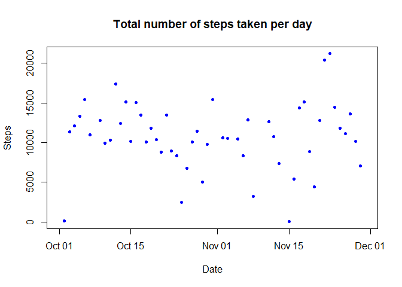
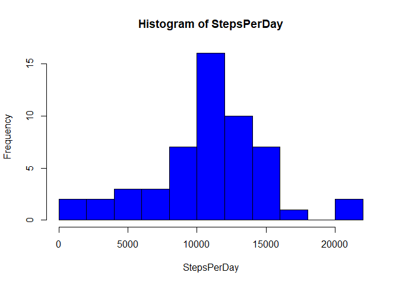
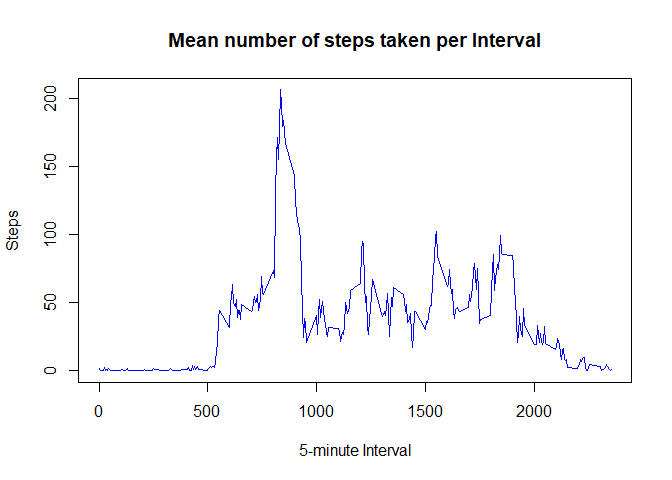
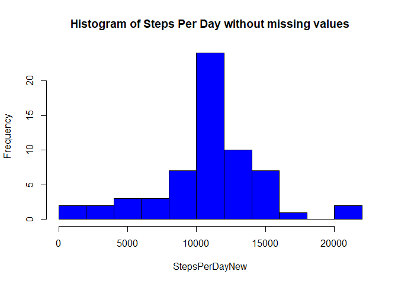
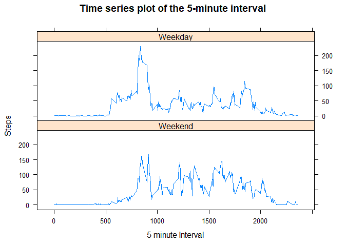

# Activity Analysis: Reproducible Research


## 1. Loading and Preprocessing the data  

Begin by loading all relavent packages:

```r
library(lattice)
library(lubridate)
```

```
## 
## Attaching package: 'lubridate'
```

```
## The following object is masked from 'package:base':
## 
##     date
```

Start by reading the csv file into R.


```r
Activity <- read.csv("activity.csv")
str(Activity)
```

```
## 'data.frame':	17568 obs. of  3 variables:
##  $ steps   : int  NA NA NA NA NA NA NA NA NA NA ...
##  $ date    : Factor w/ 61 levels "2012-10-01","2012-10-02",..: 1 1 1 1 1 1 1 1 1 1 ...
##  $ interval: int  0 5 10 15 20 25 30 35 40 45 ...
```
## 2. What is the mean total number of steps taken per day?
Total number of steps taken per day:

```r
StepsPerDay <- tapply(Activity$steps, Activity$date, FUN = sum)
plot(ymd(names(StepsPerDay)), StepsPerDay, 
     pch = 20, 
     type = "p", 
     col = "blue", 
     xlab = "Date", 
     ylab = "Steps", 
     main = "Total number of steps taken per day")
```

<!-- -->

Plot a histogram of the data 

```r
hist(StepsPerDay, col = "blue", breaks = 11)
```

<!-- -->

Mean and median number of steps per day

```r
MeanSteps <- mean(StepsPerDay, na.rm = TRUE)
MeanSteps
```

```
## [1] 10766.19
```

```r
MedianSteps <- median(StepsPerDay, na.rm = TRUE)
MedianSteps
```

```
## [1] 10765
```

## 3. What is the average daily activity pattern?

Make a time series plot (i.e. \color{red}{\verb|type = "l"|}type="l") of the 5-minute interval (x-axis) and the average number of steps taken, averaged across all days (y-axis)


```r
MeanStepsPerInterval <- tapply(Activity$steps, Activity$interval, FUN = mean, na.rm = TRUE)
plot(names(MeanStepsPerInterval), MeanStepsPerInterval, 
     pch = 20, 
     type = "l", 
     col = "blue", 
     xlab = "5-minute Interval", 
     ylab = "Steps", 
     main = "Mean number of steps taken per Interval")
```

<!-- -->

Which 5-minute interval, on average across all the days in the dataset, contains the maximum number of steps?

```r
names(which(MeanStepsPerInterval == max(MeanStepsPerInterval)))
```

```
## [1] "835"
```

## 4. Imputing missing values
Calculate and report the total number of missing values in the dataset (i.e. the total number of rows with \color{red}{\verb|NA|}NAs).  
  
  True means value is missing. False means value is recorded.

```r
NAVector <- is.na(Activity$steps)
table(NAVector)
```

```
## NAVector
## FALSE  TRUE 
## 15264  2304
```
There are 2304 missing values in this dataset.  

Replace missing values with the mean of that 5 minute time interval.


```r
ActivityNAsReplaced <- Activity
for(i in 1:length(ActivityNAsReplaced$steps)){
        if (is.na(ActivityNAsReplaced$steps[i])){
                ActivityNAsReplaced$steps[i] <- MeanStepsPerInterval[which(names(MeanStepsPerInterval) == ActivityNAsReplaced$interval[i])]
        }
}

head(ActivityNAsReplaced)
```

```
##       steps       date interval
## 1 1.7169811 2012-10-01        0
## 2 0.3396226 2012-10-01        5
## 3 0.1320755 2012-10-01       10
## 4 0.1509434 2012-10-01       15
## 5 0.0754717 2012-10-01       20
## 6 2.0943396 2012-10-01       25
```

Plot a histogram to show the difference between original data and updated data with NA's replaced.


```r
StepsPerDayNew <- tapply(ActivityNAsReplaced$steps, ActivityNAsReplaced$date, FUN = sum)
hist(StepsPerDayNew, col = "blue", breaks = 11, 
     main = "Histogram of Steps Per Day without missing values")
```

<!-- -->


Mean and median number of steps per day with Updated data


```r
MeanStepsUpdated <- mean(StepsPerDayNew)
MeanStepsUpdated
```

```
## [1] 10766.19
```

```r
MedianStepsUpdated <- median(StepsPerDayNew)
MedianStepsUpdated
```

```
## [1] 10766.19
```

From these results it seems the mean did not change, however there was a very small change to the median. Both mean and median values ended up being equal.

## 5. Are there differences in activity patterns between weekdays and weekends?

The following code adds a column to the dataframe which determines whether each day is a weekday or the weekend.


```r
ActivityWeek <- ActivityNAsReplaced 
ActivityWeek$DayofWeek <- weekdays(ymd(ActivityWeek$date))

for(i in 1:length(ActivityWeek$DayofWeek)){
        if (ActivityWeek$DayofWeek[i] %in% c("Saturday", "Sunday")){
                ActivityWeek$DayofWeek[i] <- "Weekend"
        }
        else {
                ActivityWeek$DayofWeek[i] <- "Weekday"
        }
}
```

The following code finds the mean for each interval and plots it in relation to whether the date is a weekday or the weekend.


```r
AveSteps <- aggregate(ActivityWeek$steps, 
                      by = list(ActivityWeek$interval, ActivityWeek$DayofWeek), 
                      FUN = mean)

names(AveSteps) <- c("interval", "day", "steps")

xyplot(steps ~ interval|day, data = AveSteps, type = "l", layout = c(1,2), 
       xlab = "5 minute Interval", 
       ylab = "Steps", 
       main = "Time series plot of the 5-minute interval", 
       index.cond = list(2:1))
```

<!-- -->
